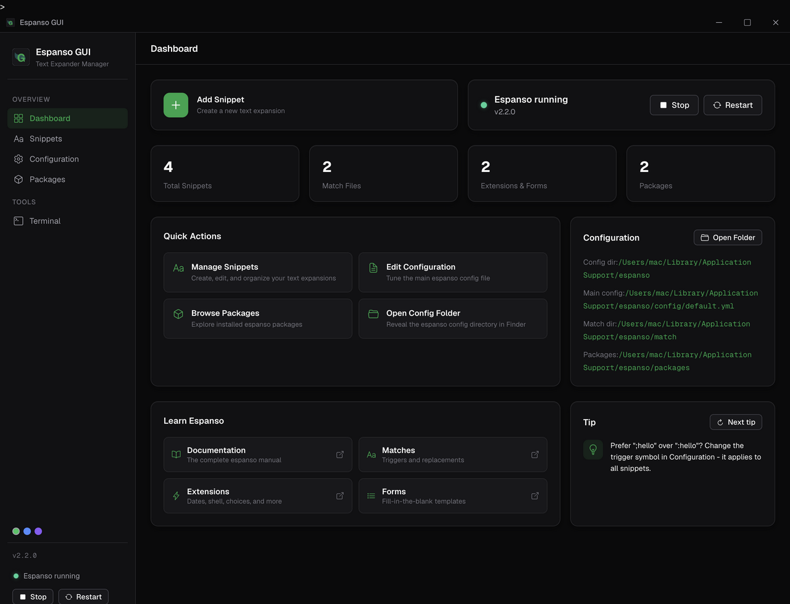
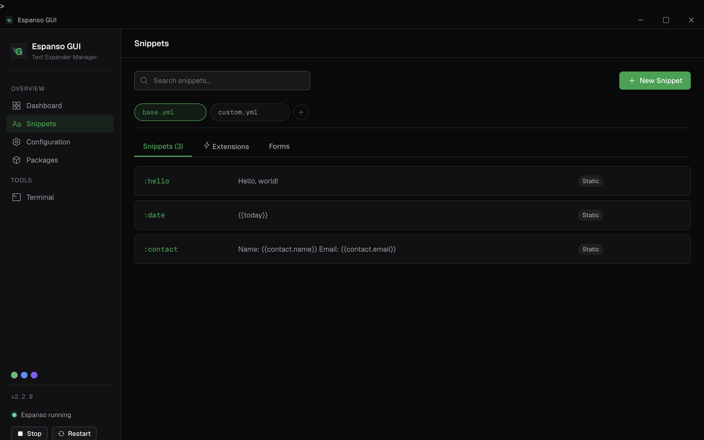
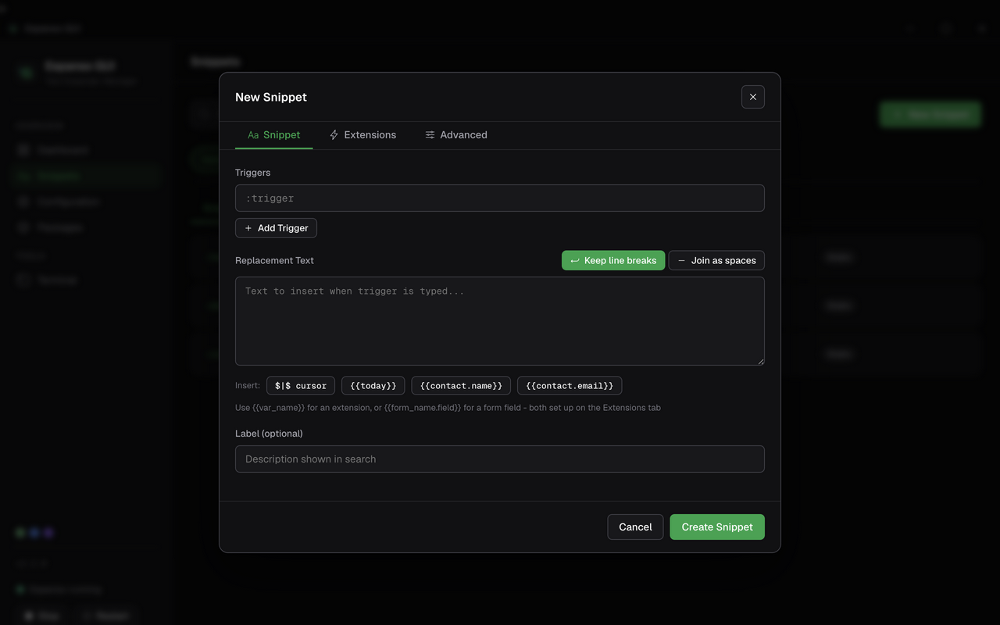
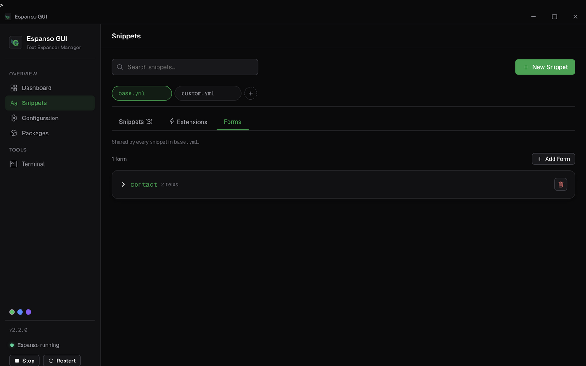
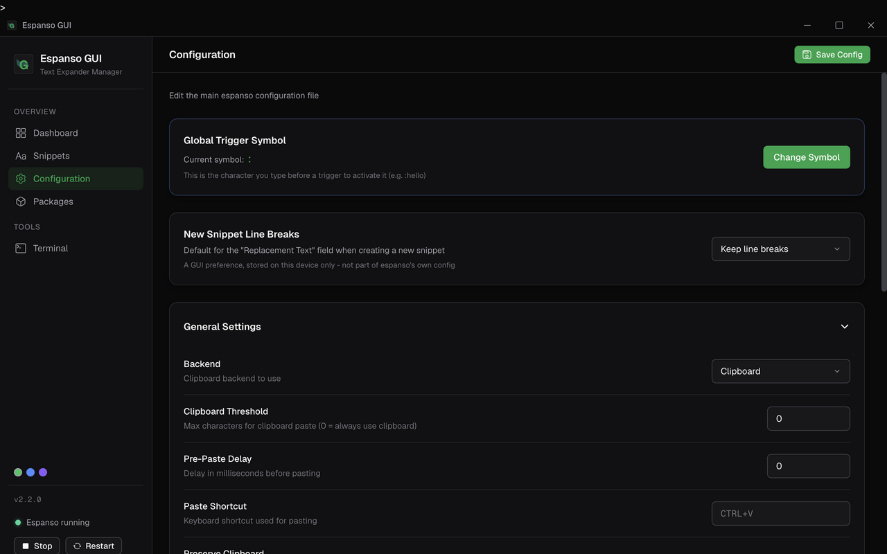
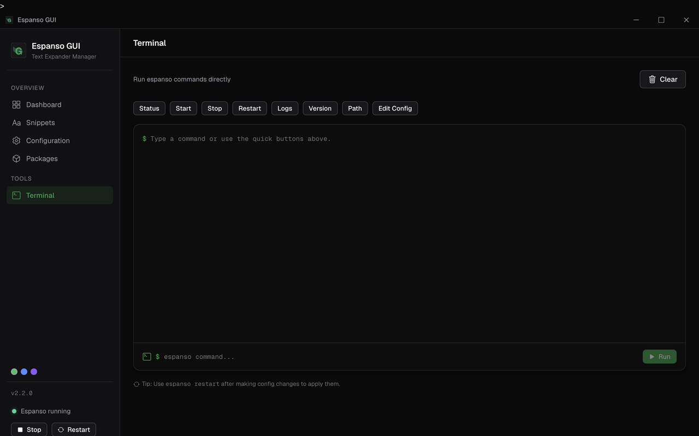

# Espanso GUI

**An unofficial, independent desktop GUI for [espanso](https://github.com/espanso/espanso)** — the cross-platform text expander. Manage your snippets, configuration, and packages without hand-editing YAML.

> ⚠️ **Not affiliated with the espanso project.** This is a third-party tool built by the community to sit on top of espanso's existing config files. All credit for the actual text-expansion engine goes to the [espanso team](https://github.com/espanso/espanso). If something breaks, please open an issue here first — not on the espanso repo.

 

## Screenshots

| Dashboard | Snippets |
|---|---|
|  |  |

| New Snippet | Form Fields |
|---|---|
|  |  |

| Configuration | Terminal |
|---|---|
|  |  |

## Features

- **🏠 Dashboard** — quick actions, at-a-glance stats (snippets, files, extensions & forms, packages), the espanso control banner, docs links, and rotating usage tips
- **📝 Snippet Management** — create, edit, search, and delete snippets across all your match files
- **🎨 Full espanso feature support**:
  - Static text replacement
  - Multiple triggers per snippet
  - Dynamic variables (date, shell, echo, random, choice, form, clipboard, counter, script)
  - Interactive forms with all field types (text, password, number, date, time, color, select, textarea, toggle, radio, checkbox)
  - Regular expression matching
  - Case propagation and word boundaries
- **⚙️ Configuration Editor** — visual settings editor plus a raw YAML editor, with comments preserved on save
- **🔤 Global Trigger Symbol** — change the trigger character (e.g. `:` → `;`) and choose whether to apply it to new snippets only or replace all existing triggers
- **🎨 3 accent themes** — Green (espanso), Blue, Violet
- **📦 Package Manager** — install, uninstall, and browse espanso packages
- **🖥️ Terminal** — run espanso commands directly from the GUI
- **🚀 Espanso Control** — start, stop, and restart espanso from the sidebar or the dashboard banner

## Install Espanso GUI

Grab the latest build from the [Releases page](../../releases):

- **`EspansoGUI-Setup.exe`** — Windows installer (recommended). Adds a Start Menu entry, lets you pick an install directory.
- **`EspansoGUI-portable.exe`** — no install, just run it from anywhere.
- **`EspansoGUI-*.dmg`** — macOS.
- **`EspansoGUI-*.AppImage`** / **`.deb`** — Linux.

> Requires [espanso](https://espanso.org/docs/get-started/) to already be installed — this app is a GUI for espanso's existing config, not a replacement for it. If a platform's build isn't on the Releases page yet, see [Build from source](#build-from-source) below to run it there today.

None of the builds are code-signed. Windows SmartScreen and macOS Gatekeeper will both warn about an unidentified publisher on first launch — on Windows click **More info → Run anyway**; on macOS right-click the app → **Open**.

## Build from source (want to develop / run on macOS or Linux)

### Prerequisites

- [espanso](https://espanso.org/docs/get-started/) installed on your system
- [Node.js](https://nodejs.org/) 18+ and npm

### Setup

```bash
git clone https://github.com/djekanovic/espanso-gui.git
cd espanso-gui
npm install
```

### Develop

Run the Vite dev server and the Electron window in two terminals (the
built-in `dev:electron` script is Windows-only):

```bash
# Terminal 1 — Vite dev server
npm run dev

# Terminal 2 — Electron window pointed at the dev server
VITE_DEV_SERVER_URL=http://localhost:5173 npx electron .
```

On Windows (cmd), the second line becomes `set VITE_DEV_SERVER_URL=http://localhost:5173&& npx electron .`.

### Build a distributable

```bash
npm run build   # build the renderer
npm run dist    # package a Windows exe (installer + portable) into release/
```

## Usage

1. Launch Espanso GUI
2. The app automatically detects your espanso config directory
3. The **Dashboard** gives you quick actions, live stats, espanso controls, and usage tips at a glance
4. Use the **Snippets** view to manage all your text expansions (plus **Extensions** and **Forms** tabs for variables and fill-in-the-blank forms)
5. Use the **Configuration** view to change global settings and the trigger symbol
6. Use the **Packages** view to install community packages
7. Use the **Terminal** view to run espanso commands

## Configuration Location

Espanso GUI automatically detects your espanso config directory:

| OS | Path |
|---|---|
| Windows | `%APPDATA%\espanso` |
| macOS | `~/Library/Application Support/espanso` |
| Linux | `~/.config/espanso` |

## Contributing

Issues and PRs welcome. This is a young project maintained in spare time — please be patient, and check open issues before filing a duplicate.

## License

GNU General Public License v3.0 (or later) — see [LICENSE](LICENSE)

## Related

- [espanso](https://github.com/espanso/espanso) — the universal text expander this GUI manages
- [espanso docs](https://espanso.org/docs/get-started/)
- [espanso hub](https://hub.espanso.org) — package registry
